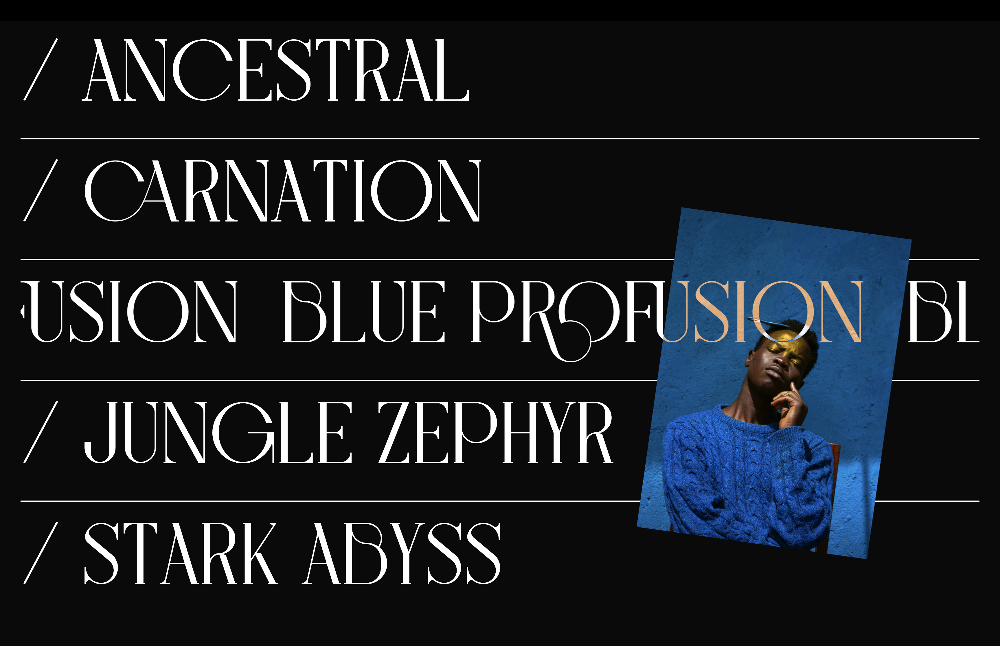

# Brutalist Personal Photography Portfolio

## Table of contents

- [Overview](#overview)
  - [The challenge](#the-challenge)
  - [Screenshot](#screenshot)
  - [Links](#links)
- [My process](#my-process)
  - [Built with](#built-with)
  - [What I learned](#what-i-learned)
  - [Continued development](#continued-development)
  - [Useful resources](#useful-resources)
- [Author](#author)
- [Acknowledgments](#acknowledgments)

## Overview

### The challenge

This is my recreation of Codegrid's [Minimalist Portfolio](https://github.com/harrnish/minimalist-portfolio) project. Credits to Codegrid for the design. _The implementation is entirely my own._

### Screenshots

**Full-page Site Preview**


**Marquee Effect Preview**


### Links

- [Live Demo](https://wsp-cg-minimal-brutalist.vercel.app/)

## My process

### Built with

- [Vue.js](https://vuejs.org/)
- [Vite](https://vitejs.dev/)
- [Locomotive Scroll](https://locomotivemtl.github.io/locomotive-scroll/)
- [SASS](https://sass-lang.com/)
- [Pug](https://pugjs.org/api/getting-started.html)
- [TypeScript](https://www.typescriptlang.org/)
- Mobile-first workflow
- [Unplugin Auto Import](https://github.com/antfu/unplugin-auto-import)
- [Unplugin Vue Components](https://github.com/antfu/unplugin-vue-components)
- [Vercel](https://vercel.com/)

### What I learned

To develop this site, I had to overcome several challenges, which taught me these lessons:

#### _1. Versions of the `unplugin-vue-components` package above `v0.18.5` break intellisense for auto-imported components._

At the time of this writing, higher versions export the global type declaration module for auto-imported components as `@vue/runtime-core` instead of `@vue`. Manually changing the module name to `@vue` or using `v0.18.5` restores intellisense support.

```ts
declare module 'vue' {
  export interface GlobalComponents {
    AboutSection: typeof import('./components/AboutSection.vue')['default']
    ClientsSection: typeof import('./components/ClientsSection.vue')['default']
    HomePageSection: typeof import('./components/atoms/HomePageSection.vue')['default']
    ProjectsSection: typeof import('./components/molecules/ProjectsSection/ProjectsSection.vue')['default']
    SocialsSection: typeof import('./components/SocialsSection.vue')['default']
    TheFooter: typeof import('./components/TheFooter.vue')['default']
    TheHeroArea: typeof import('./components/TheHeroArea.vue')['default']
    TheTopBar: typeof import('./components/TheTopBar.vue')['default']
  }
}
```

I opened [an issue](https://github.com/antfu/unplugin-vue-components/issues/477) to report this bug.

#### _2. Beware of default font optimizations._

Whenever I used a self-hosted variant of the Bigilla font instead of my machine's local copy, all browsers would render it with a significantly thicker stroke that the font originally had. This would break the aesthetic style of the site, and it took me a while to figure out that browsers sometimes simulate artificial variants of a font when only one font weight is provided in the type definitions.

This line fixed the problem:

```sass
:root
  font-synthesis: none
```

#### _3. Make it very clear how an animation works_

Learning how to recreate the marquee effect was tricky, because although there were many tutorials showing you what numbers to write to get the effect, it took me a while to make sense of those numbers and see why they had to be what they were. I also noticed that the relationship between multiple related values was not ever made explicit in any of the tutorials I checked, and that changing one of the factors in the markup (like the number of words inside the marquee), would break the animation.

So, I leveraged css variables and Vue's special `v-bind()` directive for css to create a marquee animation with explicit relationships that would continue to work as intended even if the number of items inside the marquee changed in the future.

```sass
.text-stream
  --single-word-width: calc(100% / v-bind(wordsPerTextStream))
  --one-word-out-of-sight: calc(var(--single-word-width) * -1)
  --two-words-out-of-sight: calc(var(--single-word-width) * -2)
  --offset: 20vw
  //...not a magic number. helps make the word out of sight be partially visible
  --move-initial: calc(var(--one-word-out-of-sight) + var(--offset))
  --move-final: calc(var(--two-words-out-of-sight) + var(--offset))
  animation: stream 5s linear infinite
```

#### _4. Place images in the public folder instead of the assets folder_

Using dynamically bound images from the assets folder worked in development mode, but the binding was not updated correctly by Vite for the production bundle. After some experimentation, I found that placing my images in the `public` folder Vite creates at the directory's root worked well for dynamically bound images in both development and production.

```vue
<template lang="pug">
  ul.projects-list
    li.project(v-for="(projectTitle, index) in projects")
      h3.project-title / {{ projectTitle }}
      img.photo(:src="`/images/model-${index + 1}.jpeg`" alt="human face")
</template>
```

In searching for an answer to this issue before I found my own, I stumbled upon a Stack Overflow post where a bunch
of people were facing this same challenge. Since the question was still marked as unsolved, I [shared my solution](https://stackoverflow.com/a/73284282/13668847) with the community.

### Useful resources

- [Marquee Animation](https://tympanus.net/codrops/2020/03/31/css-only-marquee-effect/) - This helped me understand how the marquee effect works in principle.
- [Marquee Animation 2](https://www.youtube.com/watch?v=sVZX0XvEBhk) - This tutorial helped me consolidate my understanding of the marquee effect with a very useful visual explanation, in addition to opening my eyes to different approaches, like a js-based implementation.

## Author

- Twitter: [@mareszhar](https://twitter.com/mareszhar)
- LinkedIn: [@mareszhar](https://www.linkedin.com/in/mareszhar/)
- Frontend Mentor: [@mareszhar](https://www.frontendmentor.io/profile/mareszhar)

## Acknowledgments

Special thanks to Harrnish from Codegrid for making the original design and [video](https://www.youtube.com/watch?v=oWSOXX4nnoc) that prompted me to take on this fun challenge! Looking forward to recreating more of Codegrid's sites.
